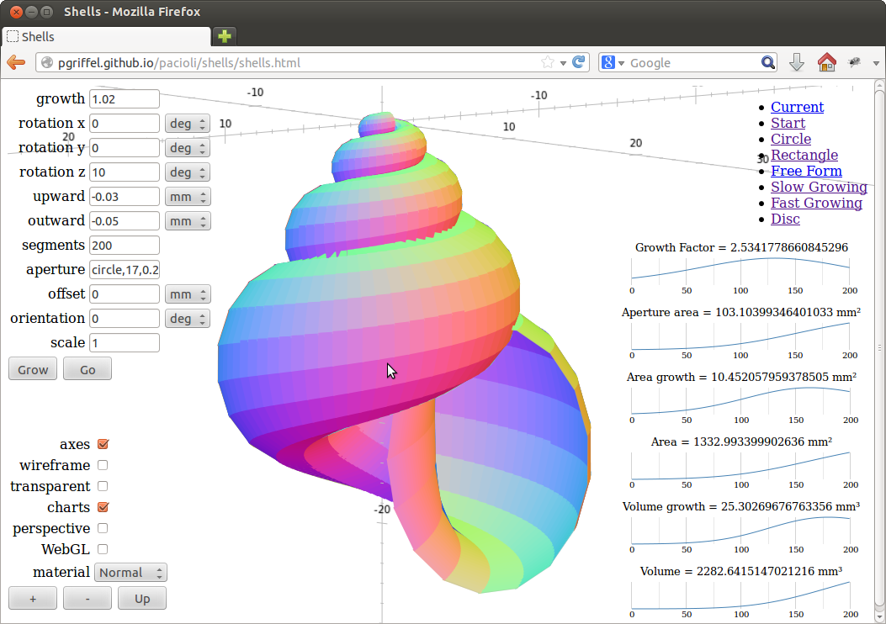

Introduction
------------

The matrix language Pacioli adds type safety and dimensional anaylysis
to mathematical software. Its parametric type system infers vector and
matrix types based on dimensioned vector spaces.

Pacioli programs can be run directly via the command line, or compiled
to JavaScript and deployed via the web. 

Documentation
-------------

Pacioli is described in the [manual](manual.html). The
[specification](specification.html) lists the available functions.

Examples
--------

[][shells]
The [shells example][shells] illustrates many aspectes of the
language. It demonstrates vectors and matrices, units of measurement,
deployment via the web, charts and other features.

The shell is computed in [Pacioli code][prog] and displayed on the
page with [three.js][three].

All computations are guaranteed unit correct and derived by the
compiler. For example

    define triangle area(x, y, z) =
        norm(cross(y - x, z - x)) / 2;

has as derived type

    triangle area :: for unit a: (a*Space!, a*Space!, a*Space!) -> a^2

See the tutorials in the documentation section below for more examples.

[shells]: shells
[three]: http://threejs.org/
[prog]: shells/shells.pacioli

Tutorials
---------

A short introduction to units of measurements in Pacioli is in the
[tutorial on unit inference][inference].  The [Kirchhof
case][kirchhof] on the equilibrium in an eletrical network explains
the use of matrices.

The [tutorial on matrices][matrices] gives some details on Pacioli's
type system. It is about the power consumption of Nasa's curiosity
rover and involves vectors where the units of measurement vary per
element.

Working with the web and javascript is explained in the [tutorial on
3D][space] and the [tutorial on charts][charts]

[inference]: unit-inference.html
[matrices]: matrices.html
[kirchhof]: kirchhof.html
[space]: space.html
[charts]: charts.html

Download and Installation
-------------------------

Install Pacioli from the [GitHub project][home]. You can also view
more samples there.

[home]: https://github.com/pgriffel/pacioli

License and Status
------------------

Pacioli is released under an MIT license. See the file LICENSE in the
root directory of the sources.

This Pacioli version is for research purposes. The implementation is
reasonably complete. However, it doesn't support many features for
input and output yet.
