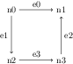

Kirchhof Tutorial
=================

Computing the equilibrium in an electrical network.

--------------------------------------------------------------------------------

The Problem
-----------

The problem comes from one of Strang's textbooks and asks to compute
the equilibrium in an electricity network [Strang 88]. The network
consists of four nodes and four edges connected as follows

    

The conductivity on the edges is 1, 2, 2 and 1. Node n3 is the ground
node.

The question is to compute the equilibrium potentials and currents
given batteries on the edges and external currents that flow into the
nodes.

Modelling the network
---------------------

Create a file `kirchhof.pacioli` containing 

    import si;

    defindex Node = {n0, n1, n2, n3};

    defindex Edge = {e0, e1, e2, e3};

    defmatrix incidence :: Edge! per Node! = {
      e0, n0 -> -1,
      e0, n1 ->  1,
      e1, n0 -> -1,
      e1, n2 ->  1,
      e2, n1 ->  1,
      e2, n3 -> -1,
      e3, n2 -> -1,
      e3, n3 ->  1
    };

    defmatrix conductance :: ampere/volt*Edge! = {
      e0 -> 1,
      e1 -> 2,
      e2 -> 2,
      e3 -> 1
    };

    define ground = Node@n3;

    incidence;
    conductance;

The code creates a module Kirchhof and include the module SI for the
units of measurement used later on. The index sets `Node` and `Edge`
contain the four nodes and four edges from the problem. The incidence
matrix encodes the network and the conductance is put in a vector. The
last two lines with just `incidence;` and `conductance;` are for
testing and will print the values.

Inferring the types in the file will display:

    ground :: Index(Node);
    toplevel 1 :: Edge! per Node!
    toplevel 2 :: ampere/volt*Edge!

The ground node is an index from the `Node` index set. The incidence
matrix and the conductance vectors have the types that we defined.

Running the file should produce the following matrix and vector

    Index             Value
    -----------------------
    e0, n0        -1.000000 
    e0, n1         1.000000 
    e1, n0        -1.000000 
    e1, n2         1.000000 
    e2, n1         1.000000 
    e3, n2        -1.000000 

    Index             Value
    ---------------------------
    e0             1.000000 A/V
    e1             2.000000 A/V
    e2             2.000000 A/V
    e3             1.000000 A/V

Grounding the Network
---------------------

The next step is to take the ground node into account. Without
grounding a node the problem is underspecified and has an infinite
number of solutions.

We will ground the network by making the column of the ground node
zero. This differs from the common approach to remove the ground
column from the incidence matrix. This would require manipulation of
the index set and the matrix type doesn't support that. If we make the
column zero we will get the same answer because the solver gives a
least norm solution.

Instead of filtering the column directly we make a function to do
that. Add the following code:

    define filter_column(matrix, column) = 
      make_matrix([tuple(x, y, get(matrix, x, y)) | x <- row_domain(matrix),
                                                    y <- column_domain(matrix),
                                                    y != column]);

Type inference gives the following type for this function.

    filter_column :: for_index B,C: for_unit a: (a*B! per C!, C) -> a*B! per C!

The filtered matrix is of the same shape but with a column set to
zero. This is just what we need and we can use the function to filter
the ground column from the incidence matrix

    define grounded_incidence = filter_column(incidence, ground);

The type is

    grounded_incidence :: Edge! per Node!

As expected the result is a dimensionless `Edge` by `Node` matrix,
just as the incidence matrix itself.

Computing Equilibrium
---------------------

With the network grounded we can compute the equilibrium. This
requires solving Kirchhof and Ohm's equilibrium equations.

Let unknown x contain potentials at the nodes, unknown y contain
currents at the edges, matrix A be the incidence matrix and diagonal
matrix C the conductance. The equilibrium equations are:

y = C(b - Ax) and A'y = f

Key to the solution are matrices A'C and A'CA. Rearranging the
equilibrium equations tells that the equation to solve for x is A'CAx
= A'Cb - f. The value for y then follows from the substitution of the
value of x.

First define matrices A'C and A'CA. Let's name them `M1` and
`M2`. Function `diagonal` from the standard library creates a diagonal
matrix from the conductance vector.

    define M1 = grounded_incidence^T '*' diagonal(conductance);
    define M2 = M1 '*' grounded_incidence;

Type inference gives the following types

    M1 :: ampere*Node! per volt*Edge!
    M2 :: ampere*Node! per volt*Node!

This shows that matrix `M1` transforms vectors from the `volt*Edge!`
space to the `ampere*Node!` space. Similarly matrix `M2` transforms
vectors from the `volt*Node!` space to the `ampere*Node!`.

With the matrices we can compute the potential and the
current. Solving the matrices gives the potential, and
back-substitution gives the current.

    define potential(battery, inflow) =
      M2 '\' (M1 '*' battery - inflow);

    define current(battery, inflow) = 
      conductance * (battery - grounded_incidence '*' potential(battery, inflow));

The inferred types are

    potential :: for_index C: for_unit a,b:
                   (a*Edge! per C!b, a*ampere*Node! per volt*C!b) -> a*Node! per C!b
    current :: for_unit a:
                 (a*Edge!, a*ampere*Node!/volt) -> a*ampere*Edge!/volt

These types are correct but too general. The following type
declarations strengthen them to the desired case.

    declare potential :: (volt*Edge!, ampere*Node!) -> volt*Node!;
    declare current :: (volt*Edge!, ampere*Node!) -> ampere*Edge!;

These types describe the computations exactly. The volt per edge and
the ampere per node are given, and the volt per node and the ampere
per edge are computed.

A Case
------

Define a battery and an inflow vector as follows

    defmatrix my_battery :: volt*Edge! = {
      e0 -> 12,
      e1 -> 12,
      e2 -> 6,
      e3 -> 6
    };

    defmatrix my_inflow :: ampere*Node! = {
      n0 -> 1,
      n1 -> 1,
      n2 -> 6,
      n3 -> 0
    };

The potential and current can be computed with the functions from the
previous section.

    define my_potential = potential(my_battery, my_inflow);
    define my_current = current(my_battery, my_inflow);

    my_potential;
    my_current;

The inferred types are:

    my_potential :: volt*Node!
    my_current :: ampere*Edge!

The result is:

    Index             Value
    -------------------------
    n0           -16.000000 V
    n1             2.333333 V
    n2            -6.666667 V

    Index             Value
    -------------------------
    e0            -6.333333 A
    e1             5.333333 A
    e2             7.333333 A
    e3            -0.666667 A

References
----------

[Strang 88] <i>Gilbert Strang. 1988. Linear Algebra and Its Applications. Brooks</i>
Cole. 
