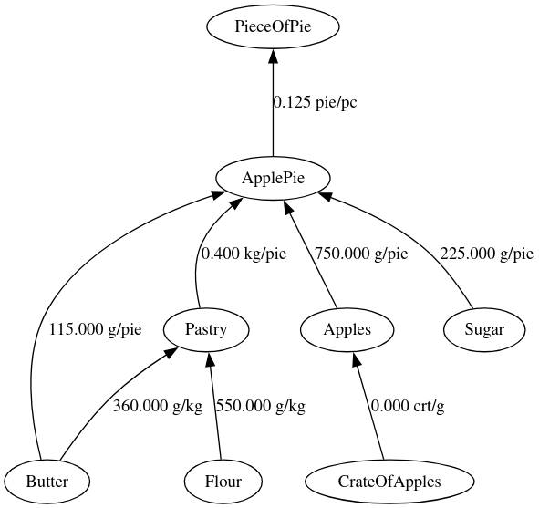

# Bill of Material

The bill of material examples demonstrates various computates with a matrix with non-uniform units of measurement. The
products in a bill of material matrix can have different units of measurement.

The code for the example is in file [bom.pacioli]. The bill of material matrix from the example is

    Product, Product                     Value
    ------------------------------------------
    Butter, Pastry                     360.000 g/kg
    Butter, ApplePie                   115.000 g/pie
    Flour, Pastry                      550.000 g/kg
    Pastry, ApplePie                     0.400 kg/pie
    Apples, ApplePie                   750.000 g/pie
    Sugar, ApplePie                    225.000 g/pie
    ApplePie, PieceOfPie                 0.125 pie/pc
    CrateOfApples, Apples                0.000 crt/g

An example of the output is the product cost. The units are derived automatically.

    Product          Value
    ----------------------
    Pastry            1.16 $/kg
    Apples            5.00 $/kg
    ApplePie          4.56 $/pie
    PieceOfPie        0.57 $/pc

## Visualization

[][bom]

The bill of material and its closure are [visualized as directed graphs][bom].
The hmtl page for the visualization is in [bom.html]

The dot images are generated with [viz.js], a collection of packages for working with [graphviz] in JavaScript.

[bom]: /samples/bom/bom.html
[graphviz]: https://graphviz.org/
[viz.js]: https://github.com/mdaines/viz-js?tab=readme-ov-file
[bom.pacioli]: https://raw.githubusercontent.com/pgriffel/pacioli/develop/samples/bom/bom.pacioli
[bom.html]: https://raw.githubusercontent.com/pgriffel/pacioli/develop/samples/bom/bom.html
