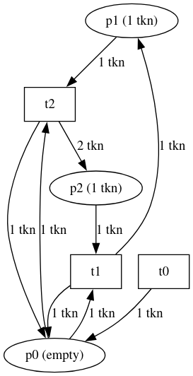

# Petri Nets

The Petri net library implements dimensioned Petri nets. A dimensioned Petri net adds units of measurement to the net's places.

The first example is a simple Petri net with just three places and three transitions. The code is in [net.pacioli]

The second example is the subtraction grame. The code is in [subtraction_game.pacioli]. The winner for different start states is
computed with a mini-max algorithm.

The code to run the nets and the mini-max algorithm is in [net_behavior.pacioli].

## Visualization

[][petri]

The Petri nets are [visualized as directed graphs][petri].
The code for the web page is in [petri-net.html]
It contains javascript code to generate dot output.

The dot images are generated with [viz.js], a collection of packages for working with [graphviz] in JavaScript.

[petri]: /samples/net/petri-net.html
[net.pacioli]: https://raw.githubusercontent.com/pgriffel/pacioli/develop/samples/net/net.pacioli
[subtraction_game.pacioli]: https://raw.githubusercontent.com/pgriffel/pacioli/develop/samples/net/subtraction_game.pacioli
[net_behavior.pacioli]: https://raw.githubusercontent.com/pgriffel/pacioli/develop/samples/net/net_behavior.pacioli
[petri-net.html]: https://raw.githubusercontent.com/pgriffel/pacioli/develop/samples/net/petri-net.html
[graphviz]: https://graphviz.org/
[viz.js]: https://github.com/mdaines/viz-js?tab=readme-ov-file
