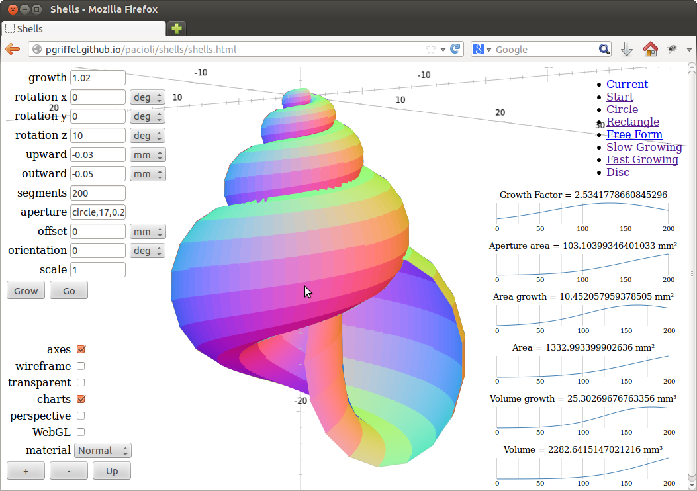

# Shells

[][shells]

The [shells example][shells] illustrates many aspectes of the
language. It demonstrates vectors and matrices, units of measurement,
deployment via the web, charts and other features.

The shell is computed in [Pacioli code][prog] using a seperate module
for the [model][proglib]. It is displayed on the page with library
[three.js][three].

The computation does not block the browser, but the code is somewhat outdated and
needs an upgrade. The javascript code in the HTML page computes the shell in small steps
to avoid blocking the event loop. The api it uses is however not stable and will probably
change in the future.

[shells]: /samples/shells/shells.html
[three]: http://threejs.org/
[prog]: https://raw.githubusercontent.com/pgriffel/pacioli/master/samples/shells/shells.pacioli
[proglib]: https://raw.githubusercontent.com/pgriffel/pacioli/master/samples/shells/model.pacioli
