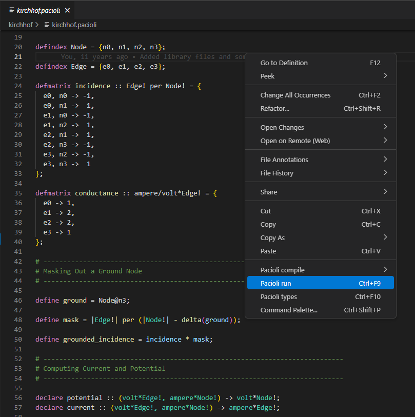

# Pacioli README

Pacioli is a statically typed matrix language.

This extension offers editor support for the Pacioli language. Visit [Pacioli on Github](http://pgriffel.github.io/pacioli/) for information about the language itself.

## Features

- Syntax highlighting
- Error diagnostics
- Menus for compiling and running pacioli files
- Documentation on hover
- Go to definition
- Task definition for pacioli commands

## Requirements

Java needs to be installed.

## Extension Settings

This extension contributes the following settings:

- `pacioli.libdir`: directory containing the Pacioli libraries.

## Known Issues

- No debugger support
